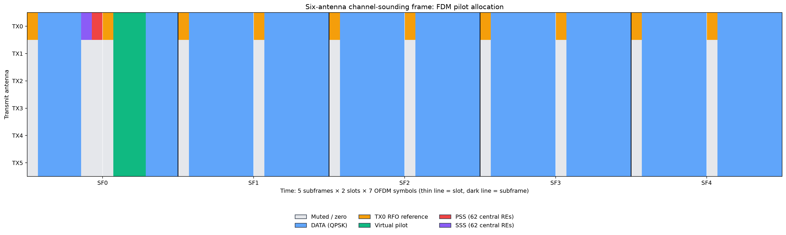
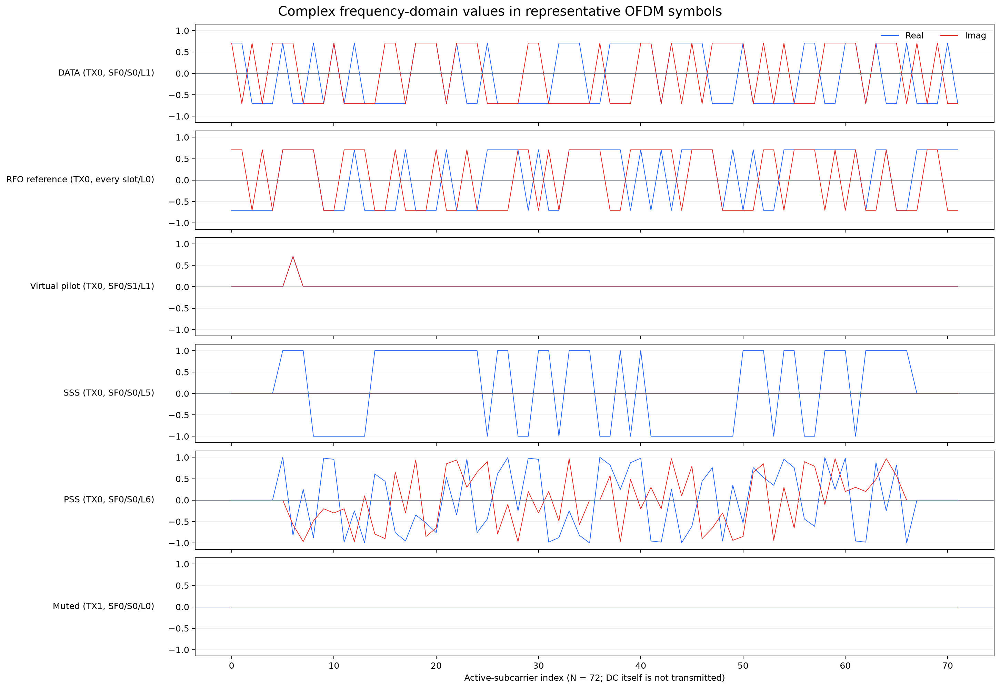

# Distributed MIMO Channel Sounding

## TurtleBot 4 Lite UE keyboard control

The physical UE can be moved from an interactive terminal on the TurtleBot 4
Lite Raspberry Pi. The controller uses arrow keys, publishes on `/cmd_vel`,
and automatically stops the base when keyboard events stop arriving.

First check which ROS 2 distribution is installed on the Raspberry Pi:

```bash
echo "$ROS_DISTRO"
ls /opt/ros
grep WORKSPACE_SETUP /etc/turtlebot4/setup.bash
```

If `ROS_DISTRO` is empty, source the setup selected by the last command. For
example:

```bash
source /opt/ros/jazzy/setup.bash
```

Copy this repository to the Raspberry Pi, enter its root directory, and run
the launcher. It sources the TurtleBot ROS configuration automatically and
uses the system Python that provides `rclpy` and `geometry_msgs`:

```bash
./scripts/run_turtlebot4_teleop.sh
```

Do not use `uv run` or a project virtual environment for this node. ROS Python
modules are installed with ROS under `/opt/ros`, not from this project's PyPI
dependencies. An editor opened on macOS may therefore underline those imports;
that does not indicate a missing project dependency.

Use Up/Down to move, Left/Right to rotate, Space to stop, `+`/`-` to adjust
speed, and `q` to quit. Defaults are deliberately conservative: 0.15 m/s
linear speed, 0.8 rad/s angular speed, and a 0.6 s input timeout. They can be
changed as follows. The controller caps them at the TurtleBot 4 limits of
0.31 m/s and 1.9 rad/s:

```bash
./scripts/run_turtlebot4_teleop.sh \
  --linear-speed 0.10 --angular-speed 0.60 --timeout 0.60
```

ROS 2 Jazzy uses `geometry_msgs/msg/TwistStamped`; Humble and Galactic use
`geometry_msgs/msg/Twist`. The controller selects this from `ROS_DISTRO`.
If the robot image has a nonstandard configuration, inspect and override it:

```bash
ros2 topic type /cmd_vel
./scripts/run_turtlebot4_teleop.sh --stamped
./scripts/run_turtlebot4_teleop.sh --unstamped
```

Run the controller directly on the Raspberry Pi or through `ssh -t` so that
the terminal receives arrow-key input. Before driving, put the robot on the
floor with a clear safety area and verify that Space stops it.

이 저장소의 USRP 송신 프레임은 3개의 RU, RU당 2개의 송신 안테나를 가정한
6-TX 채널 사운딩 프레임이다. 원본 학습 데이터와 호환되는 FDM pilot만
사용한다.

## 6-TX 프레임 구조



기본 프레임의 시간축은 다음과 같다.

- 프레임당 subframe: 5개 (`SF0`–`SF4`)
- subframe당 slot: 2개 (`slot 0`, `slot 1`)
- slot당 OFDM symbol: 7개 (`L0`–`L6`)
- 프레임당 총 OFDM symbol: `5 × 2 × 7 = 70`
- 송신 안테나: `TX0`–`TX5`; `TX0/1`, `TX2/3`, `TX4/5`가 각각 하나의
  RU에 속한다.

그림의 한 칸은 한 안테나의 한 OFDM symbol을 나타낸다. DATA와 RFO reference는
해당 symbol의 모든 active subcarrier를 사용한다. 기본 FDM virtual pilot은
TX별로 할당된 한 subcarrier만 사용하며 나머지는 0이다. PSS와 SSS는 중앙
62개 active resource element(RE)만 사용하며 나머지는 0이다.

### 시간축 인덱스

Subframe, slot, symbol 인덱스를 하나의 global OFDM symbol 인덱스로 바꾸면
다음과 같다.

```text
global_slot   = 2 × subframe + slot
global_symbol = 7 × global_slot + symbol
```

### 심볼별 송신 값

| 종류 | 위치 | 송신 안테나 | 주파수 영역 값 |
|---|---|---|---|
| RFO reference | 모든 slot의 `L0` | TX0만 송신 | 길이 `N`의 known QPSK reference |
| Virtual pilot (FDM) | `SF0/S1/L1`–`L3` | TX0–TX5 동시 송신 | TX별 전용 subcarrier의 known QPSK 값을 3회 반복 |
| PSS | `SF0/S0/L6` | TX0만 송신 | 중앙 62 RE에 Zadoff–Chu sequence |
| SSS | `SF0/S0/L5` | TX0만 송신 | 중앙 62 RE에 seed 0의 BPSK sequence |
| DATA | 위 자원과 겹치지 않는 위치 | TX0–TX5 | 독립적인 QPSK symbol |
| Muted | 다른 TX에 할당된 pilot/sync 위치 | 해당 TX 이외 안테나 | `0 + 0j` |

RFO reference와 virtual pilot에는 같은 `known_ref_seq`가 들어간다. 기본
1.4 MHz 실행에서는 `N = 72`이고, 실행 시 reference seed는
`REFERENCE_SEQUENCE_SEED + 10 × bandwidth_MHz = 2040`이다. 각 원소는
정규화된 QPSK 집합

```text
{(+1+j)/sqrt(2), (+1-j)/sqrt(2), (-1+j)/sqrt(2), (-1-j)/sqrt(2)}
```

중 하나다.

PSS는 길이 62, root `q = 25`인 다음 Zadoff–Chu sequence다.

```text
PSS[m] = exp(-j × pi × 25 × m × (m + 1) / 62),  m = 0, ..., 61
```

### FDM virtual-pilot 배치

모든 TX가 `SF0/S1`의 `L1`–`L3`에서 동시에 pilot을 송신한다. TX별 pilot은
서로 다른 subcarrier를 사용하므로 UE는 합성 수신 신호에서 여섯 채널을
분리할 수 있다. Pilot 이외의 subcarrier는 0이다.

| TX | Centered FFT bin | Active-subcarrier index | Pilot symbol |
|---:|---:|---:|---|
| 0 | -30 | 6 | `SF0/S1/L1`–`L3` |
| 1 | -18 | 18 | `SF0/S1/L1`–`L3` |
| 2 | -6 | 30 | `SF0/S1/L1`–`L3` |
| 3 | +6 | 41 | `SF0/S1/L1`–`L3` |
| 4 | +18 | 53 | `SF0/S1/L1`–`L3` |
| 5 | +30 | 65 | `SF0/S1/L1`–`L3` |

각 5 ms 프레임에서 원본 형식의 CSI vector 하나를 얻는다.

```text
csi.shape = (time, tx) = (time, 6)
```

## 실시간 모델 입력 경로

실시간 경로에서는 학습 데이터용 NPZ를 만들지 않는다. 채널 추정기가 출력한
5 ms CSI 벡터 하나를 예측기 버퍼와 스케줄러 버퍼에 동시에 복사한다.

```text
5 ms CSI (6,)
  ├─ 5개 누적  = 25 ms  → gain/cos/sin token (6, 15) → predictor queue
  └─ 20개 누적 = 100 ms → RU gain (3,)               → scheduler queue
```

예측기 토큰의 각 행은 한 TX의 연속된 CSI 5개이며, 열 순서는
`[gain × 20, cos(phase), sin(phase)]`이다. 스케줄러 입력은 안테나 0/1,
2/3, 4/5를 각각 RU1, RU2, RU3으로 묶어 학습 환경과 같은 방식으로 평균한
100 ms 이득이다. 스케줄러 작업자는 이 값에 최근 3개 구간의 이력과 현재
연결 상태 one-hot을 결합하여 최종 15차원 관측값을 만든다.

윈도우에는 시작/끝 frame index와 host/USRP timestamp만 붙는다. RX block 또는
timestamp가 연속되지 않으면 두 부분 윈도우를 모두 비워 서로 다른 시간 구간의
CSI가 한 모델 입력에 섞이지 않게 한다. 모델 입력 queue가 가득 찬 경우에는
수신 루프를 멈추지 않고 오래된 입력을 버린 뒤 최신 입력을 유지한다.

FDM에서 얻은 TX별 scalar CSI는 논문의 주파수 평탄 채널 가정에 따라 기존
full-band 결과 배열에서는 72개 active subcarrier에 broadcast된다. 실제 측정
값의 기준 배열은 NPZ의 `csi`다.

### 5 ms 채널 추정

채널 추정기는 한 5 ms 프레임의 pilot 3개를 평균하여 CSI 하나를 계산한다.
FDM 측정 배열의 shape은 다음과 같다.

```text
csi_repetitions_scalar.shape
= (num_csi_samples, num_tx_ant, num_virtual_pilots, num_rx_ant)
= (1, 6, 3, num_rx_ant)

csi_scalar_raw.shape
= (num_csi_samples, num_tx_ant, num_rx_ant)
= (1, 6, num_rx_ant)
```

원본 데이터 convention에 맞춰 기본값은 pilot 반복 간 위상 정렬을 적용하지
않는다. 위상 정렬 결과도 별도 배열에 함께 저장한다. 프레임의 SF0–SF4
전체에는 CSI sample 0이 대응된다.

## 저장 결과와 메타데이터

`results.py`가 저장하는 결과 스키마는 version 4이다. 모델 학습용 기본 배열은
원본과 같은 `time → TX` 순서다.

```text
csi = (time, tx)
csi_repetitions = (time, virtual_pilot, tx)
csi_repetitions_aligned = (time, virtual_pilot, tx)
pilot_received = (time, virtual_pilot, tx)
csi_timestamps_usrp_s = (time,)
```

동시에 비교 분석용 상세 결과도 유지한다. 상세 채널 사운딩 결과의 공통 축
순서는 `capture → CSI sample → RX → TX`이며, 마지막 축에
subcarrier 또는 delay sample이 붙는다. 채널 추정기 내부의 `TX → RX` 순서는
저장할 때 `RX → TX` 순서로 바뀐다.

```text
channel_estimates_fd
= (capture, rx, tx, subframe, slot, subcarrier)

channel_mean_fd
= (capture, csi_sample, rx, tx, subcarrier)

channel_estimates_fd_virtual_pilots
= (capture, csi_sample, rx, tx, virtual_pilot, subcarrier)

channel_impulse_response_td
= (capture, csi_sample, rx, tx, delay_sample)
```

NPZ에는 원본 호환 CSI뿐 아니라 pilot별 원본/위상 정렬 채널, single-pilot
기준 채널, SNR, 분산, 지연 응답을 함께 저장한다. FDM 모드에서 상세 full-band
배열은 scalar CSI를 주파수 평탄 채널로 broadcast한 값이다. JSON 메타데이터와 NPZ 내부
`metadata_json`에는 각 배열의 축 이름(`array_axis_order`)과 실제 shape
(`saved_array_shapes`), TX/RX 수, 프레임당 CSI sample 수, 5 ms sample 주기,
FDM pilot bin이 기록된다.

## 실제 주파수 영역 값

아래 그림은 기본 1.4 MHz 설정에서 대표 OFDM symbol의 실수부와 허수부를
표시한다. DATA는 그림을 재생성할 때 고정된 난수 seed를 사용하지만 실제
실행에서는 매 프레임 생성 시 새 데이터가 만들어진다.



PSS와 SSS 그림에서 중앙 62 RE 이외의 값은 0이다. 기본 FDM virtual pilot은
할당된 한 RE만 non-zero이고, muted symbol의 모든 값은 0이다.

## Resource grid와 waveform

`build_frame()`이 만드는 주파수 영역 resource grid의 shape은 다음과 같다.

```text
resource_maps_tx.shape
= (num_tx_ant, num_subframes, num_slots, num_symbols, N)
= (6, 5, 2, 7, 72)  # 기본 1.4 MHz 설정
```

기본 1.4 MHz 프레임은 총 `30,240`개의 active RE를 갖는다.

| 구분 | 전체 6-TX RE 수 |
|---|---:|
| DATA QPSK | 23,760 |
| TX0 RFO reference | 720 |
| Virtual pilot | 18 (6 TX × 3 pilots × 1 RE) |
| PSS + SSS non-zero RE | 124 |
| Muted/zero RE | 5,618 |
| 합계 | 30,240 |

OFDM modulation에서는 active subcarrier를 DC 양쪽 FFT bin에 배치하고 DC
bin은 비워 둔다. 각 slot의 `L0`에는 first CP가, `L1`–`L6`에는 normal CP가
붙는다. 마지막으로 시간 영역 파형에 `sqrt(POWER)`를 곱한다. 기본값
`POWER = 4`이므로 시간 영역 진폭 배율은 2다.

최종 waveform shape은 다음과 같다.

```text
waveform.shape = (num_tx_ant, frame_length_samples)
```

즉 각 행이 하나의 송신 안테나에 전달되는 연속 complex baseband sample이다.

## 그림 재생성

프레임 설정을 변경한 뒤 다음 명령으로 문서 그림을 다시 생성할 수 있다.

```bash
uv run python scripts/plot_tx_frame.py
```

그림 생성에 사용되는 주요 설정은
[`config/radio_config.py`](config/radio_config.py)에 있고, 실제 자원 배치는
[`USRP/build_frame.py`](USRP/build_frame.py)와
[`USRP/helper_functions.py`](USRP/helper_functions.py)에 구현되어 있다.
